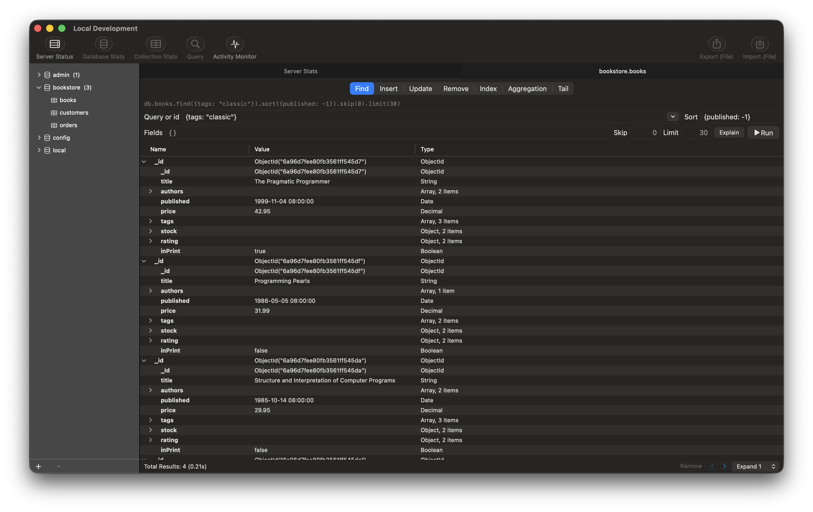
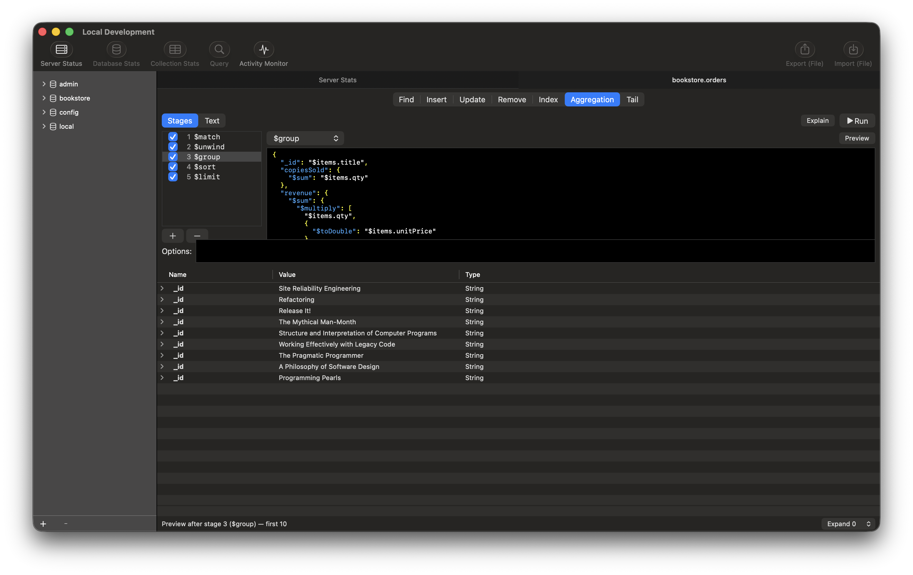
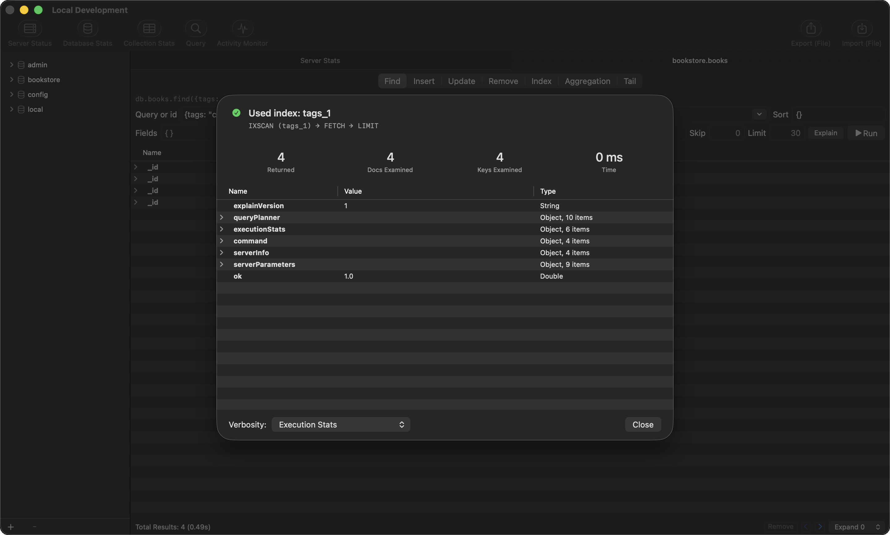
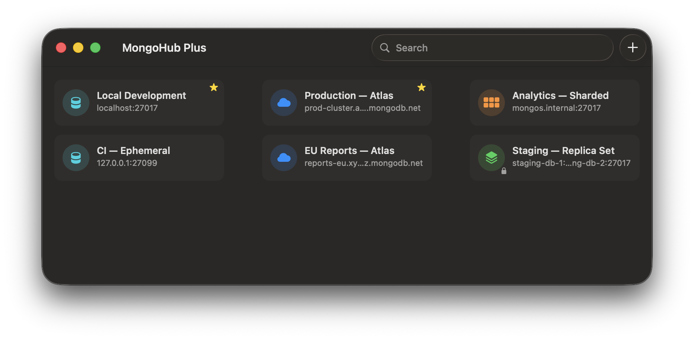
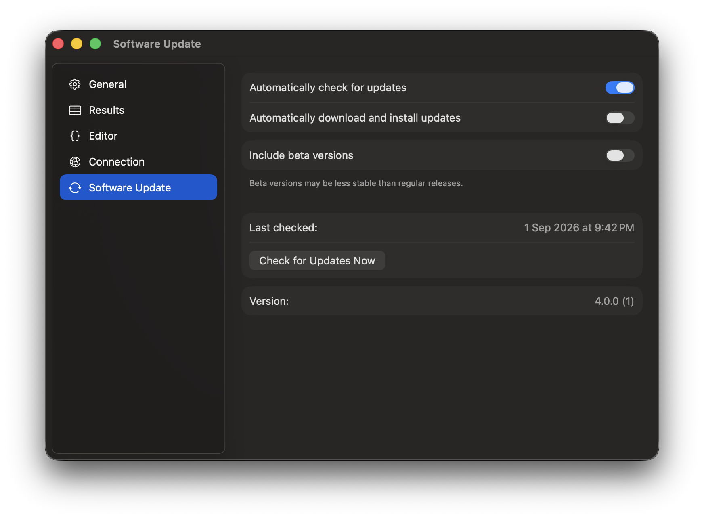

# MongoHub Plus

A native macOS MongoDB GUI — the modern revival of **[MongoHub](https://github.com/jeromelebel/MongoHub-Mac)**.

MongoHub was a beloved Mac MongoDB client (2010–2015, Objective-C, by Syd Xu and later Jérôme Lebel) that has been abandoned for over a decade: it targets OS X 10.8, is Intel-only, pre-ARC, and no longer compiles on any modern Mac. MongoHub Plus rebuilds it from scratch as a 2026-standard macOS app:

- **Swift 6** + AppKit, async/await, strict concurrency
- **[MongoKitten](https://github.com/orlandos-nl/MongoKitten)** as the driver (pure Swift; the official MongoDB Swift driver was discontinued and recommends it)
- Universal binary (Apple Silicon + Intel), signed, notarized, sandboxed
- Same UI, same workflows — a MongoHub user should feel instantly at home



<table>
  <tr>
    <td width="50%">
      <br>
      <sub><b>Aggregation stage builder</b> — per-stage live previews, Stages ⇄ Text</sub>
    </td>
    <td width="50%">
      <br>
      <sub><b>Explain plans</b> — index verdict, plan chain, execution stats</sub>
    </td>
  </tr>
  <tr>
    <td width="50%">
      <br>
      <sub><b>Connection manager</b> — pinned favorites, Atlas, SSH tunnels</sub>
    </td>
    <td width="50%">
      <br>
      <sub><b>Sparkle auto-updates</b> — with an optional beta channel</sub>
    </td>
  </tr>
</table>

## Install

Download the latest `MongoHubPlus-x.y.z.dmg` from
[Releases](https://github.com/BossaGroove/MongoHubPlus/releases/latest), open
it, and drag **MongoHub Plus** into Applications. The app is a universal
binary (Apple Silicon + Intel), Developer ID-signed, notarized, and
sandboxed; it keeps itself up to date via Sparkle (Settings → Software
Update).

Requires **macOS 14 (Sonoma) or later**. MongoDB **6.0+** servers and
**MongoDB Atlas** are supported (older servers may work but are untested).

## Features

- **Connection manager**: a card grid of saved connections (standalone / replica set / sharded / **MongoDB Atlas via `mongodb+srv://`**) with search and pinned favorites; auth, TLS, SSH tunnels (trust-on-first-use host keys), connection-string paste per the current MongoDB spec, passwords in the macOS Keychain. Multiple windows per connection.
- **Browse**: databases → collections sidebar with stats (server/db/collection, including `$jsonSchema` validation rules) rendered as expandable BSON trees.
- **Query**: Find (query history, projection, sort, paging), Insert, Update (operator builder), Remove, Index management with **usage stats**, an **aggregation stage builder** (per-stage live previews, Text ⇄ Stages modes), and a **live change-stream Tail**.
- **Explain plans**: one click on any query or pipeline — index-vs-collection-scan verdict, execution stats, and index suggestions.
- **Edit documents** in place in the results tree (values, add/delete fields — type-fidelity preserved) or in a syntax-colored JSON editor using official MongoDB Extended JSON (Compass-compatible; accepts mongosh-style input like `ObjectId(…)` and unquoted keys), with byte-level round-trip verification so editing never silently changes BSON types. Typing a bare id in a query field still means `{_id: ObjectId("…")}` — the classic MongoHub shortcut.
- **Monitor**: mongostat-style live activity table, log window.
- **Import/Export**: JSON-Lines (lossless canonical Extended JSON) and CSV (flattened, spreadsheet-friendly) — whole collections, current query results, or selected documents.
- **Localized**: English, 日本語, Deutsch, 繁體中文, 简体中文, Français — switchable in Settings.

## New since the original MongoHub

The goal is parity with the original first — but a decade of MongoDB and
macOS evolution brought features the original never had:

- **MongoDB Atlas** — `mongodb+srv://` DNS seed lists, TLS, SCRAM
  authentication. The original predates Atlas entirely.
- **Query explain plans** — one-click explain for the exact current query or
  pipeline: index-vs-collection-scan verdict, winning-plan chain, execution
  stat tiles, and index suggestions.
- **Aggregation stage builder** — build pipelines stage by stage: per-stage
  enable/disable, drag to reorder, an operator menu, and a live preview of
  the results after any stage. Text mode remains, and converts both ways.
- **Index usage stats** — `$indexStats` merged into the Index pane: per-index
  operation counts and a callout for indexes that have never been used.
- **Live change-stream Tail** — watch a collection's inserts, updates, and
  deletes arrive in real time (replica sets and Atlas).
- **In-place document editing** — edit values and add or delete fields
  directly in the results tree; the original only offered the separate JSON
  editor window (which is still there too).
- **Schema validation display** — a collection's `validator`,
  `validationLevel`, and `validationAction` shown with its stats.
- **Official MongoDB Extended JSON v2** — Compass-compatible output and
  mongosh-style input (`ObjectId(…)`, unquoted keys, `ISODate(…)`); the
  original spoke its own JSON dialect no other tool understood.
- **CSV import/export** — exports flatten to dotted spreadsheet columns;
  imports type each cell and rebuild nested documents and arrays.
- **Export scopes** — export the current query's full matching results or
  just the selected documents, not only whole collections.
- **Pinned favorite connections and connection search** — plus multiple
  windows per connection.
- **SSH host-key verification** — trust-on-first-use prompts instead of the
  original's `StrictHostKeyChecking=no`.
- **Passwords in the macOS Keychain** — never in the connection store.
- **Six languages** — fully localized UI, switchable in Settings without
  changing the system language.
- **System dark and light appearance** — with a follow-system default and an
  in-app override.

## Writing queries

Anywhere MongoHub Plus takes JSON — the query bar, Insert, Update, the
aggregation builder, the document editor — you can write it two ways, and
mix them freely.

Official [Extended JSON](https://www.mongodb.com/docs/manual/reference/mongodb-extended-json/),
exactly as Compass and `mongoexport` produce it:

```json
{"_id": {"$oid": "6a96d7fee80fb3561ff545e9"}, "price": {"$numberDecimal": "42.95"}}
```

Or mongosh shorthand, exactly as you would type it in the shell — unquoted
keys and single quotes included:

```javascript
{ _id: ObjectId('6a96d7fee80fb3561ff545e9'), price: NumberDecimal('42.95') }
```

The shorthand covers every BSON type:

| Shorthand | Type | Same value in Extended JSON |
|---|---|---|
| `ObjectId('6a96…')` | ObjectId | `{"$oid":"6a96…"}` |
| `ISODate('2026-01-01T00:00:00Z')`<br>`ISODate('2026-01-01')`<br>`new Date(1767225600000)` | date | `{"$date":"2026-01-01T00:00:00Z"}` |
| `NumberInt(7)` | 32-bit integer | `7` — no wrapper needed |
| `NumberLong('9007199254740993')` | 64-bit integer | `{"$numberLong":"9007199254740993"}` |
| `NumberDecimal('42.95')` | Decimal128 — exact, no float rounding | `{"$numberDecimal":"42.95"}` |
| `/^mongo/i`<br>`RegExp('^mongo', 'i')` | regular expression | `{"$regularExpression":{"pattern":"^mongo","options":"i"}}` |
| `BinData(0, 'SGVsbG8=')` | binary | `{"$binary":{"base64":"SGVsbG8=","subType":"00"}}` |
| `UUID('123e4567-…')` | UUID | `{"$binary":{"base64":"Ej5FZ…","subType":"04"}}` |
| `Timestamp(1699999999, 1)` | timestamp | `{"$timestamp":{"t":1699999999,"i":1}}` |
| `Code('function () { … }')` | JavaScript | `{"$code":"function () { … }"}` |
| `MinKey()` / `MaxKey()` | min / max key | `{"$minKey":1}` / `{"$maxKey":1}` |
| `NaN` / `Infinity` | special doubles | `{"$numberDouble":"NaN"}` / `{"$numberDouble":"Infinity"}` |

So a filter can stay readable even with typed values:

```javascript
{ price: { $gt: NumberDecimal('20') }, published: { $lt: ISODate('2000-01-01T00:00:00Z') } }
```

A date on its own means UTC midnight, as it does in the shell:
`ISODate('2026-01-01')` is `2026-01-01T00:00:00Z`. A timestamp with **no**
time zone — `ISODate('2026-01-01T10:00:00')` — is refused rather than
guessed at, because JavaScript reads it as local time and mongosh reads it
as UTC; add `Z` or an offset like `+08:00`.

**Typing a bare id looks it up.** Paste `6a96d7fee80fb3561ff545e9` into the
query bar on its own and it becomes `{_id: ObjectId('6a96d7fee80fb3561ff545e9')}` —
the shortcut from the original MongoHub, kept.

**You can read documents in either syntax as well.** Settings → Syntax has a
row per place — the results table, editing a value in place, copy, and the
JSON editor — each choosing between Extended JSON and shell syntax
independently, since they are different jobs. It changes what you see, never
what is accepted: typing works the same either way.

**Exported files are always Extended JSON**, whichever style you type in.
JSON-Lines exports are valid JSON that Compass, `mongoimport`, and every
driver can read — the shorthand is a convenience for writing and reading in
the app, never something we write into a file.

## Building from source

```bash
brew install xcodegen
xcodegen generate
xcodebuild -project MongoHubPlus.xcodeproj -scheme MongoHubPlus build
```

The Xcode project is generated — edit `project.yml`, never the pbxproj. The
local packages have their own test suites:
`swift test --package-path Packages/ExtendedJSON` (tested against the
official BSON corpus) and `…/MongoService`, whose integration tests are
env-gated: set `MONGOHUBPLUS_TEST_URI=mongodb://localhost:27017` with a
local server running (e.g. `docker run -p 27017:27017 mongo:7`), or they
skip.

## Credits

MongoHub Plus is a from-scratch rewrite, but it owes its design entirely to **MongoHub** — created by [Syd Xu](https://github.com/bububa) (ThePeppersStudio, 2010), massively extended and maintained by [Jérôme Lebel](https://github.com/jeromelebel) (2011–2015), with [many contributors](https://github.com/jeromelebel/MongoHub-Mac/graphs/contributors). Thank you.

## License

MIT